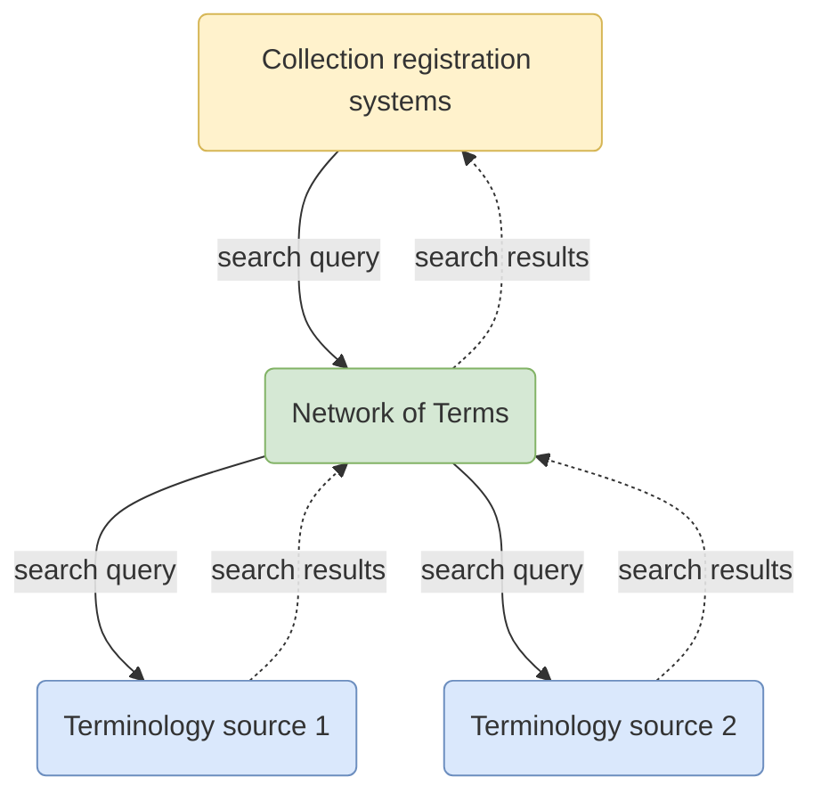

# Network of Terms

The Network of Terms is a **search engine for finding terms** in terminology sources (such as thesauri, classification
systems and reference lists).

Given a textual search query, the Network of Terms searches one or more terminology sources in
**real-time** and returns matching terms, including their labels and URIs. The Network of Terms offers a **simple search
interface**, **handles errors** gracefully in case a source does not respond well and **harmonizes the results** to the
SKOS data model.

The Network of Terms is intended for **managers of heritage information** that want to improve the findability of their
information by assigning terms from terminology sources that are used by the institutions in
the [Dutch Digital Heritage Network](https://netwerkdigitaalerfgoed.nl). Information managers use the Network of Terms
in their **collection registration system**.

Schematically, the registration system sends out a single query to the Network of Terms, which gets translated to a set
of queries that is appropriate for each terminology source. The terms matching the query are harmonized to SKOS and
returned to the collection registration system where information managers can evaluate the results and link their
data to the terms:

## Getting started

### For users

If you just want to search the Network of Terms using a web interface, have a look at our
[demonstrator](https://termennetwerk.netwerkdigitaalerfgoed.nl), a web interface on top of the
[GraphQL API](packages/network-of-terms-graphql/).

### For application developers

If you’re a software developer who wants to implement terms search/lookup in your software (such as collection 
management systems), you probably want to use the Network of Terms
[GraphQL API](packages/network-of-terms-graphql/README.md#for-application-developers).

### For Network of Terms developers

If you want to make changes to the Network of Terms code or catalog, the best way to get started is to run the 
application [locally using Node](packages/network-of-terms-graphql/README.md#for-network-of-terms-developers)
or [in a development Docker container](docs/docker.md).

### Packages

This repository contains the following packages:

- [network-of-terms-catalog](packages/network-of-terms-catalog): the catalog of terminology sources in the Network of
  Terms that can be queried;
- [network-of-terms-cli](packages/network-of-terms-cli): query the Network of Terms from the command line;
- [network-of-terms-graphql](packages/network-of-terms-graphql): a GraphQL API to find terms;
- [network-of-terms-query](packages/network-of-terms-query): core query logic which executes the queries to terminology
  sources;
- [network-of-terms-reconciliation](packages/network-of-terms-reconciliation): a Reconciliation Service API for matching
  strings against terms with URIs.

### Contributing

You’re very welcome to contribute to this repository:

- [create an issue](https://github.com/netwerk-digitaal-erfgoed/network-of-terms/issues/new) if you encounter a problem
  or have suggestions;
- read [CONTRIBUTING](CONTRIBUTING.md) if you wish to commit code. 
